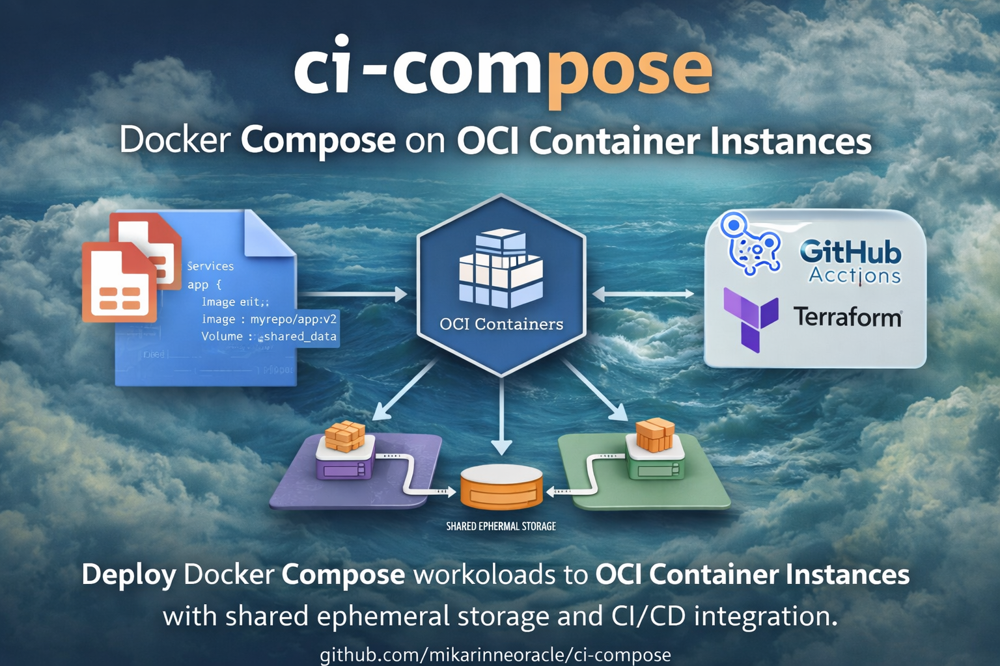

<div align="center">
  
</div>

# CI Compose

CI Compose is a comprehensive management tool designed for Oracle Cloud Infrastructure (OCI) Container Instances. It provides an intuitive interface for creating, configuring, and managing container instances with support for multiple containers, sidecars, volumes, and networking configurations.

> **Notice:** This software (version 0.1.1) is currently intended for experimental use and evaluation purposes. It is not recommended for production environments at this time.

## Features

- Create and manage OCI Container Instances
- Configure containers with custom images, sidecars, resource limits, and environment variables
- Manage sidecars from the Sidecar Gallery (stock and custom sidecars)
- Configure networking with port mappings and subnet selection. Subnet security lists are not modified automatically and must be updated manually as required.
- Manage volumes and volume mounts shared between containers for data exchange
- View container logs (using OCI Logging sidecar) and instance details
- Edit, restart, stop, and delete container instances
- Restore deleted container instances with the same configuration (volumes and subnet are recreated from current configuration)
- Export Container Instances configurations to OCI Resource Manager (Terraform)
- Import Docker Compose YAML files to quickly set up Container Instances
- CI/CD integration: Export to OCI Resource Manager for automated deployments using OCI CLI

## UI Changes (Version 0.1.1)

Starting with version 0.1.1, CI Compose features a modern dark theme with a teal/cyan color palette, replacing the previous light theme. This update provides:

- **Dark Mode Interface**: A sleek dark slate background (#0f172a) that reduces eye strain, especially during extended use
- **Teal/Cyan Accent Colors**: Primary teal (#14b8a6) and cyan (#06b6d4) accents throughout the interface for a modern, professional appearance
- **Enhanced Readability**: Improved contrast ratios and carefully selected text colors ensure optimal readability in all lighting conditions
- **Consistent Styling**: All UI components including tables, modals, buttons, and forms have been updated to match the new dark theme
- **Terminal-Style Logs**: Container logs are displayed with a black background and white text, providing a familiar terminal-like experience

The new color scheme maintains excellent accessibility while providing a contemporary developer-focused aesthetic that aligns with modern development tools and IDEs.

## Custom Sidecars

If you want to add a custom sidecar to this project, please contact [@mikarinneoracle](https://github.com/mikarinneoracle).

## License

This software is licensed under the Universal Permissive License (UPL), Version 1.0.

The Universal Permissive License (UPL) is a permissive open source license that allows you to use, modify, and distribute the software with minimal restrictions.

## Contact

For questions, support, or inquiries, please contact:

**Mika Rinne**  
[@mikarinneoracle](https://github.com/mikarinneoracle)

## Getting Started

### Prerequisites

Before you begin, ensure you have:

- **Node.js** installed (version 14 or higher recommended)
- **Oracle Cloud Infrastructure (OCI) CLI** properly configured with valid credentials

### Installation

1. **Clone the repository:**
   ```bash
   git clone https://github.com/mikarinneoracle/ci-compose.git
   cd ci-compose
   ```

2. **Install dependencies:**
   ```bash
   npm install
   ```

3. **Start the application:**
   ```bash
   npm run dev
   ```
   
   For production use:
   ```bash
   npm run prod
   ```
   
   The application will start on `http://localhost:3000` by default.

### Configuration

Once the application is running, access the Configuration menu to set up your environment:

1. **CI Name:** Enter a name for your container instance deployments and respective settings. This name will be used as a prefix for all container instances you create and will help organize your deployments.

2. **Compartment:** Select the OCI compartment where you want to create and manage your container instances.

3. **Default Subnet:** Choose the default subnet for your container instances. This subnet is preselected during instance creation but can be overridden on a per-instance basis if required.

   When using a private subnet for container instance creation, access must be provided through an OCI API Gateway or Load Balancer, with the corresponding security rules configured manually. Using a private subnet is generally recommended as a best practice for improved security.

4. **Default Log Group (Optional):** Select a default log group if you want to view container logs through the web interface using the OCI Logging sidecar. This configuration is optional.

5. **Additional Settings:** Configure other settings such as:
   - OCI Config File Path (default: `~/.oci/config`)
   - OCI Config Profile (default: `DEFAULT`)
   - Region (auto-loaded from config file when available)
   - Auto-Reload Time (in seconds, 0 to disable)

After completing the configuration, you can start creating and managing container instances through the web interface.

## Requirements

- Node.js
- Access to an OCI tenancy with the appropriate permissions to use Container Instances, Networking, Logging, Vault, and Object Storage services, where applicable
- OCI SDK credentials configured (via `~/.oci/config` or environment variables)

## Docker Compose Import

CI Compose supports importing Docker Compose YAML files to quickly set up OCI Container Instances. This feature allows you to:

- Import standard Docker Compose configurations
- Convert Docker Compose services to OCI Container Instances
- Support for `image`, `command`, `entrypoint`, `environment`, `ports`, `volumes`, and `depends_on`
- Automatic merging of volumes and ports with existing configurations

To use this feature:
1. Click the "Import Compose" button in the Container Instances section
2. Paste your Docker Compose YAML or upload a file
3. Configure OCI-specific settings (compartment, subnet, architecture)
4. Review and create the Container Instance

For more details and examples, see the [Labs](labs/README.md) section.

## CI/CD Integration

Once a Container Instance is created (either manually or from a Docker Compose YAML), you can export it to OCI Resource Manager (Terraform) for CI/CD pipeline integration.

### Exporting to OCI Resource Manager

1. **Create or configure your Container Instance** using the CI Compose UI or by importing a Docker Compose file
2. **Export to Resource Manager**: 
   - Open the Container Instance details modal
   - Click the "Export to Resource Manager" button
   - An OCI Resource Manager Stack is created automatically
   - The stack can be executed using the OCI Cloud Console UI or via CLI/pipeline (see examples below)

### Using in CI/CD Pipelines

After exporting a Container Instance configuration to OCI Resource Manager from the CI Compose UI, you can use the exported stack in your CI/CD pipeline. The stack ID is provided when you export from the UI.

#### Example: Apply Stack using OCI CLI

```bash
# Use the stack ID that was created when exporting from CI Compose UI
# The stack ID is displayed after exporting in the CI Compose UI

# Apply the stack (create/update resources)
oci resource-manager job create-apply-job \
  --stack-id <stack-ocid-from-ui-export> \
  --execution-plan-strategy AUTO_APPROVED

# Or use plan and apply separately
oci resource-manager job create-plan-job \
  --stack-id <stack-ocid-from-ui-export>

oci resource-manager job create-apply-job \
  --stack-id <stack-ocid-from-ui-export> \
  --execution-plan-strategy APPROVED \
  --plan-job-id <plan-job-ocid>
```

#### Example: GitHub Actions Workflow

```yaml
name: Deploy Container Instance

on:
  push:
    branches: [ main ]

jobs:
  deploy:
    runs-on: ubuntu-latest
    steps:
      - uses: actions/checkout@v3
      
      - name: Configure OCI CLI
        uses: oracle-actions/configure-oci-cli@v1
        with:
          config-file-content: ${{ secrets.OCI_CONFIG }}
          private-key-content: ${{ secrets.OCI_PRIVATE_KEY }}
          passphrase: ${{ secrets.OCI_PASSPHRASE }}
          fingerprint: ${{ secrets.OCI_FINGERPRINT }}
          tenancy-id: ${{ secrets.OCI_TENANCY_ID }}
          user-id: ${{ secrets.OCI_USER_ID }}
          region: ${{ secrets.OCI_REGION }}
      
      - name: Apply Stack
        run: |
          # Use the stack ID that was created when exporting from CI Compose UI
          # Store the stack ID as a GitHub secret: OCI_STACK_ID
          oci resource-manager job create-apply-job \
            --stack-id ${{ secrets.OCI_STACK_ID }} \
            --execution-plan-strategy AUTO_APPROVED
      
      # Alternative: Use plan and apply separately for more control
      # - name: Plan Stack
      #   run: |
      #     PLAN_JOB_ID=$(oci resource-manager job create-plan-job \
      #       --stack-id ${{ secrets.OCI_STACK_ID }} \
      #       --query 'data.id' --raw-output)
      #     echo "PLAN_JOB_ID=$PLAN_JOB_ID" >> $GITHUB_ENV
      #     # Wait for plan to complete and review
      # 
      # - name: Apply Stack
      #   run: |
      #     oci resource-manager job create-apply-job \
      #       --stack-id ${{ secrets.OCI_STACK_ID }} \
      #       --execution-plan-strategy APPROVED \
      #       --plan-job-id ${{ env.PLAN_JOB_ID }}
```

#### Container Rebuilds Without Stack Changes

For scenarios where you only need to rebuild containers (e.g., after updating container images due to a code change) without making changes to the infrastructure stack (networking, volumes, resource limits, etc.), you can simply restart the container instance using the OCI CLI. This approach is faster than a full stack apply and preserves the existing IP address.

**When to use restart instead of stack apply:**
- Container image updates (e.g., after updating container images due to a code change)
- Application code changes that don't require infrastructure modifications
- Configuration changes managed through sidecars (e.g., Vault sidecar for secrets) - sidecars will reload their configuration during restart
- Quick container refresh without infrastructure changes

**Example: Restart Container Instance using OCI CLI**

```bash
# Restart a container instance by its OCID
oci container-instances container-instance restart \
  --container-instance-id <container-instance-ocid>

# Example with a specific container instance OCID
oci container-instances container-instance restart \
  --container-instance-id ocid1.containerinstance.oc1.iad.unique-id
```

**Example: Restart in CI/CD Pipeline**

```yaml
- name: Restart Container Instance
  run: |
    # Restart the container instance after image updates
    oci container-instances container-instance restart \
      --container-instance-id ${{ secrets.OCI_CONTAINER_INSTANCE_ID }}
```

> **Note:** The restart command will pull the latest image versions and restart all containers in the instance, including sidecars. This means sidecars (such as Vault for secrets management) will reload their configuration, making configuration changes convenient without requiring a full stack apply. For infrastructure changes (networking, volumes, resource limits, etc.), you should use the full stack apply process described above.

### Benefits

- **Version Control**: Track Container Instance configurations in Git
- **Automated Deployments**: Integrate with CI/CD pipelines
- **Infrastructure as Code**: Manage OCI resources declaratively
- **Reproducibility**: Deploy the same configuration across environments

## Labs

For experimental features and labs, see [Labs](labs/README.md).
